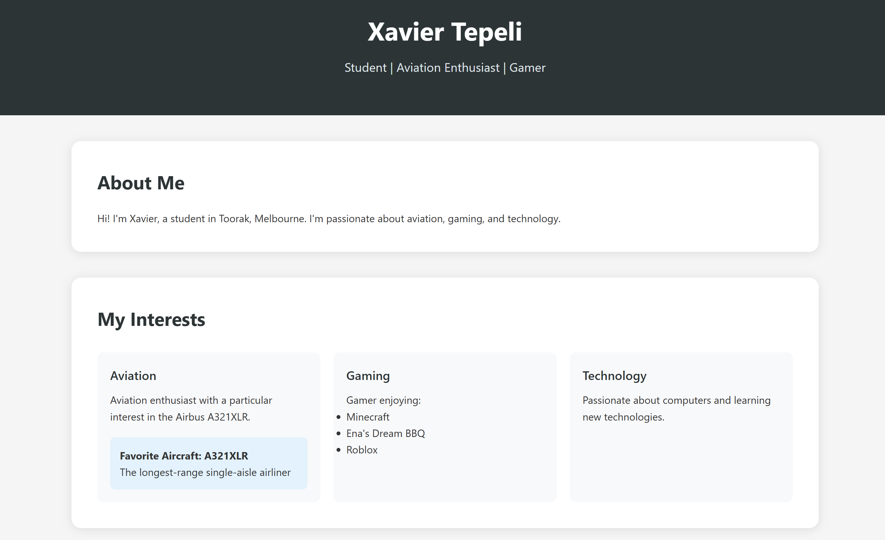

# Xavier Tepeli - Personal Website

This is the repository for my personal website that showcases information about me, my interests, and my cat Daisy.

## Overview

This is a simple, responsive personal website built with HTML and CSS. It features:

- A clean, modern design
- Mobile responsivity
- Information about my interests in aviation, gaming, and technology
- A section dedicated to my three-legged cat, Daisy

## Structure

The website consists of the following files:

- `index.html` - The main HTML file containing the structure and content
- `daisy.png` - An image of my three-legged cat, Daisy
- `README.md` - This documentation file

## Sections

The website is divided into several sections:

1. **Header** - Contains my name and a short description
2. **About Me** - A brief introduction
3. **My Interests** - Cards showcasing my interests in aviation, gaming, and technology
4. **Meet Daisy** - Information about my three-legged cat with her photo

## Technologies Used

This website is built using:

- HTML5
- CSS3 (with CSS variables, Flexbox, and Grid for layout)

## Features

- **Responsive Design**: Adapts to different screen sizes
- **Interactive Elements**: Cards with hover effects
- **Semantic HTML**: Uses proper HTML5 semantic elements for better accessibility and SEO
- **CSS Variables**: Makes the stylesheet more maintainable

## Future Improvements

Potential enhancements for the future:

- Add a contact form
- Include a photo gallery
- Add social media links
- Implement JavaScript for more interactive elements
- Create a blog section

## License

This project is available for personal use.

## Contact

Feel free to reach out if you have any questions about this project!

---

© 2025 Xavier Tepeli
